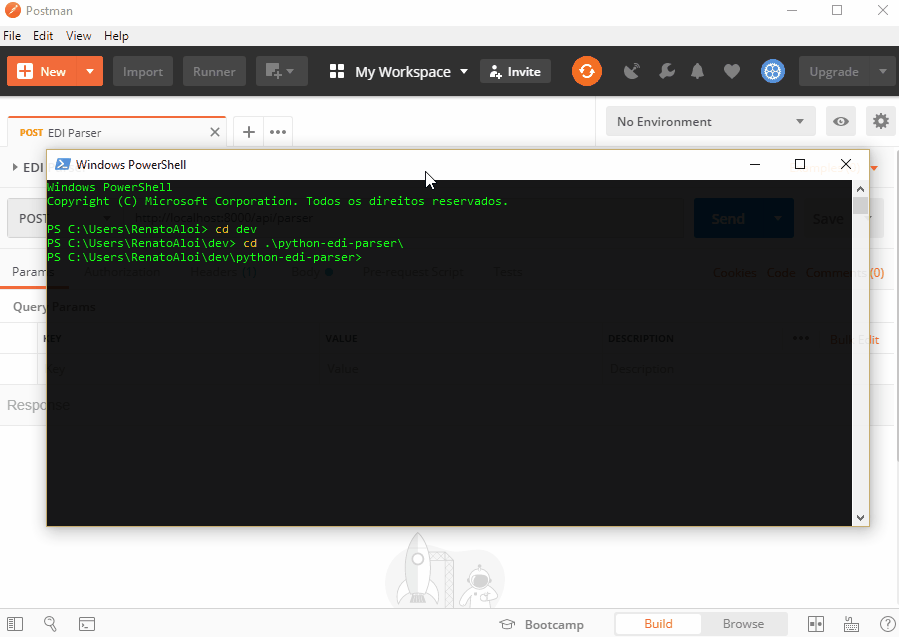

[](https://www.python.org/downloads/release/python-360/) 

# python-edi-parser
Python/Django REST Framework positional flat file reader API

## Demo



## Descrição

```python-edi-parser``` é um projeto feito em Python, utilizando framework Django, que expõe uma API REST para verificação de um arquivo EDI (arquivo texto posicional).

A API funciona recebendo um parâmetro de tipo de layout (explicado abaixo) e também um arquivo texto de upload.

O sistema de verificação do arquivo EDI é baseado em um mapeamento de layout que pode ser configurado para outros layouts de arquivos posicionais.

A aplicação foi desenvolvida utilizando o design pattern Abstract Factory para implementar as funções de ```custom_validation``` e também de ```custom_actions```.

## Documentação do arquivo EDI

https://developercielo.github.io/tutorial/edi

### Inconsistências da Documentação

- Campo 26 do registro de detalhe é do tipo numérico, mas nos comentários diz para preencher com brancos

## Especificação do mapeamento de layout

No arquivo ```settings.py``` temos uma configuração especial que é uma variável chamada ```EDI_LAYOUTS```, onde temos os layouts implementados para validar arquivos posicionais.

A vantagem dessa abordagem é que podemos adicionar novas configurações no array de layout e aumentar o leque de arquivos que podem ser verificados pelo programa, sem precisar alterá-lo.

Obs: Exceto novas ```custom_validations``` e ```custom_actions``` que precisam ser implementadas a partir das suas classes abstratas.

## Instalação

Instalar o virtual environment:

```
> pip install virtualenv
```

Crie um virtual environment:

```
> virtualenv env
```

Ative o environment ```Windows```:

```
> .\env\Scripts\activate
```

Ative o environment ```Linux/MAC```:

```
> source ./env/bin/activate
```

Instale os requisitos básicos:

```
(env) > pip install -r requirements.txt
```

Rode os comandos abaixo para finalizar a configuração do Django:

```
(env) > python ./manage.py makemigrations
(env) > python ./manage.py migrate
(env) > python ./manage.py collectstatic
```

Finalmente rode o servidor do Django:

```
(env) > python manage.py runserver
```

## Formas de uso

Na raiz do projeto existe um arquivo chamado ```test_file.txt``` que pode ser usado para testar o programa. 

No arquivo ```settings.py``` existe uma constante chamada ```EDI_LAYOUTS``` que possui os layouts utilizados pela aplicação.

Os parâmetros esperados pela API são:
- id: Que é o id do layout (por enquanto temos apenas o id 1, então basta passar 1 nesse parâmetro)
- file: Arquivo texto que será feito upload e validado pela aplicação.

O retorno da API é um JSON no seguinte formato:

```
{
    "response": "OK/FAIL",
    "valid": false/true,
    "messages": [
        "Array de mensagens de log",
        "..."
    ]
}
```

Onde:
- ```response```: retorna ```OK``` ou ```FAIL``` dependendo se o arquivo processou corretamente ou não.
- ```valid```: ```true``` se o arquivo é válido e ```false``` se não é.
- ```messages```: um array de mensagens para ajudar a identificar onde o arquivo deu problema, trazendo todas as mensagens de log geradas durante cada etapa da validação.

### Exemplo de chamada utilizando o cURL

```
curl -X POST \
  http://localhost:8000/api/parser \
  -H 'content-type: multipart/form-data; boundary=----WebKitFormBoundary7MA4YWxkTrZu0gW' \
  -F id=1 \
  -F file=@/C:/Users/RenatoAloi/python-edi-parser/test_file.txt
```

Obs: substitua o caminho do arquivo ```test_file.txt``` pelo correspondente no seu computador.

### Exemplo de uso pelo Postman

Outra forma de usar a API é chamando pelo Postman. Utilize a URL abaixo e importe no Postman, clicando no botão ```Import``` e selecionando a aba ```Import From Link```:

https://www.getpostman.com/collections/86aa206e3a7b181d746a

Depois clique na aba ```Body``` e selecione o arquivo clicando no botão ```Select Files``` do parâmetro ```file```. 

Para enviar a requisição clique no botão ```Send```.

## Configuração do mapa de layout

O programa já tem configurado com o layout do ```Arquivo para Remessa e/ou Retorno de Vendas```, do portal da Cielo, conforme esse [link](https://developercielo.github.io/tutorial/edi#arquivos-para-remessa-e/ou-retorno-de-vendas). 

Mas pode ser configurado para aceitar outros layouts de arquivos, conforme o exemplo abaixo:

```
EDI_LAYOUTS = [
    {
        'id': '99',
        'type': 'Titulo do tipo de layout',
        'layout': [
            {
                'registro': 'header',
                'regex': r'^00\d{8}\d{7}$',
                'positions': ( (1, 2), (3, 8), (11, 7), ),
                'formato': ( 'N', 'N', 'N', ),
                'obrigatorio': ( False, True, True, ),
                'custom_validation': ( None, 'Date', None, ),
                'custom_action': ( None, None, 'SaveField', )
            },
            {
                'registro': 'detalhe',
                'regex': r'^01\d{7}\d{19}.{6}$',
                'positions': ( (1, 2), (3, 7), (10, 19), (29, 6), ),
                'formato': ( 'N','N','N','X', ),
                'obrigatorio': ( False, True, True, False, ),
                'custom_validation': ( None, 'Unique', None, None, ),
                'custom_action': ( None, None, None, None, )
            },
            {
                'registro': 'trailler',
                'regex': r'^99\d{7}\d{15}$',
                'positions': ( (1, 2), (3, 7), (10, 15), ),
                'formato': ( 'N', 'N', 'N', ),
                'obrigatorio': ( False, True, True, ),
                'custom_validation': ( None, None, None, ),
                'custom_action': ( None, None, None, )
            }
        ]
    }
]
```

Onde:
- id: Um identificador único do layout, que pode ser qualquer número, desde que seja único.
- type: Um identificador de texto, que pode ser qualquer texto.
- layout: Um array de configurações, conforme segue:
    - ```registro```: Tipo do registro, pode ser ```header```, ```detalhe``` e ```trailler```.
    - ```regex```: Expressão regular que valida o layout do registro. Essa é a primeira validação que é feita no arquivo.
    - ```positions```: Tuplas de posições, que determinam o intervalo fechado de cada campo posicional do registro.
    - ```formato```: 'N' para numérico e 'X' para texto em geral.
    - ```obrigatorio```: Determina se o campo é opcional (False) ou obrigatório (True). Essa é a segunda validação que é feita no arquivo.
    - ```custom_validation```: Custom validations são funções específicas de validação avançada. Precisam ser configuradas no ```custom_rules``` do arquivo ```helpers.py```, e implementadas no arquivo ```factory\validation.py```. Essa é a terceira e última validação que é feita no arquivo.
    - ```custom_action```: Custom actions são funções específicas de ações avançadas, como por exemplo, somar o valor de um campo na tabela. Precisam ser configuradas no ```custom_actions``` do arquivo ```helpers.py```, e implementadas no arquivo ```factory\action.py```.

## Análise do código

- O código começa no arquivo ```views.py``` onde tem a ```APIView``` que executa o script macro principal. Esse script recebe o parametro ```id``` e carrega o layout correspondente. Também recebe o parâmetro ```file``` e efetua o upload deste. Depois o script começa as validações, primeiro chama a função que faz o match do regex. Na sequência valida os campos obrigatórios, e finalmente executa as ```custom_actions``` e as ```custom_validations```.
- A função que salva o upload ```save_upload``` está no arquivo ```fs.py```, junto com a função que efetua a leitura do arquivo texto ```read_file```. A função que lê o arquivo texto utiliza o retorno de cada linha através de ```yield``` que evita ter que carregar o arquivo todo na memória, caso ele tenha milhares de linhas, ou seja, para poder trabalhar com arquivos grandes.
- Já as funções que efetuam as validações, como a ```regex_match```, ```mandatory_check```, ```custom_actions```, e ```custom_rules``` estão no arquivo ```helpers.py```.
- E as funções do arquivo ```helpers.py``` chamam as funções custom validators do arquivo ```factory\validation.py``` e as funções custom actions do arquivo ```factory\action.py```, que implementam o design pattern Abstract Factory.
- Por fim temos o ORM implementado no arquivo ```models.py``` e os testes unitários no arquivo ```tests.py```.


## Testes

Para rodar os testes unitários, execute o comando abaixo:
```
(env) > python .\manage.py test
```

Para verificar a cobertura de testes do código, execute a linha abaixo:
```
(env) > coverage run --source='flatparser' .\manage.py test flatparser
```

Para exibir o relatório de cobertura de testes, execute o comando:
```
(env) > coverage report
```

ou:

```
(env) > coverage html
```
